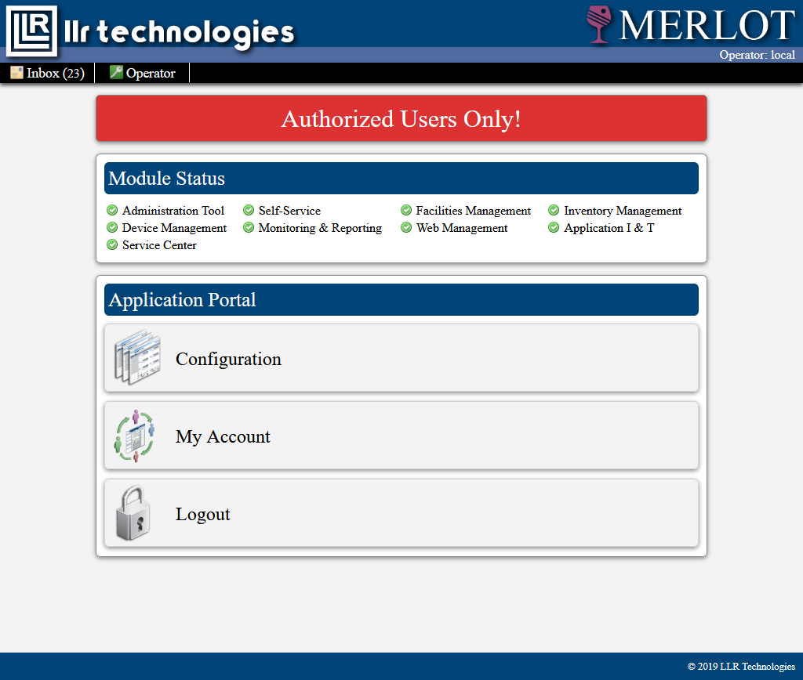
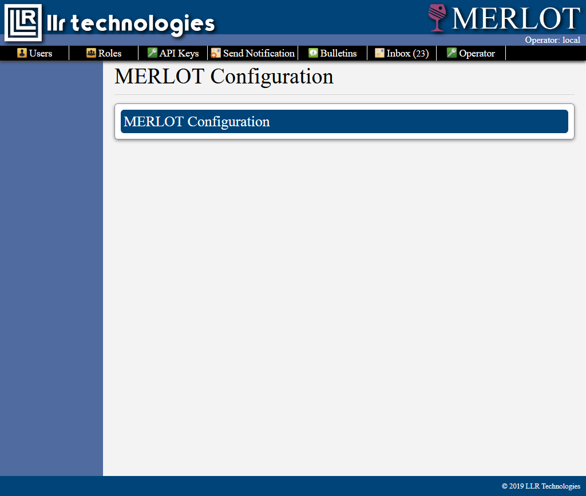
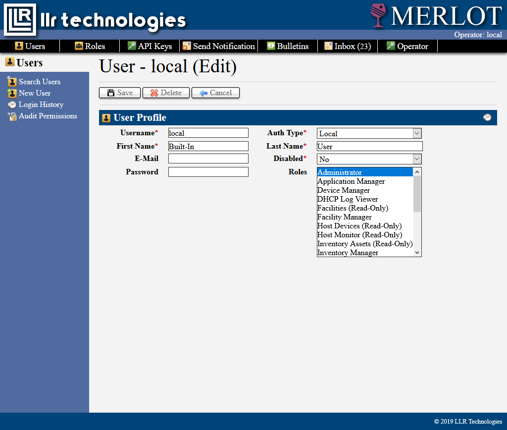
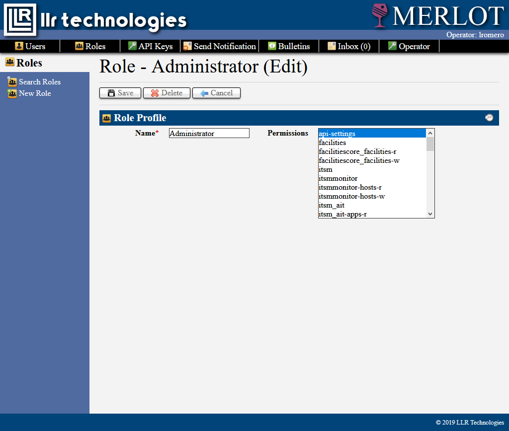
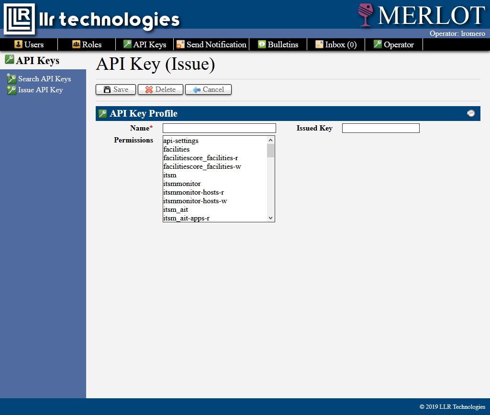
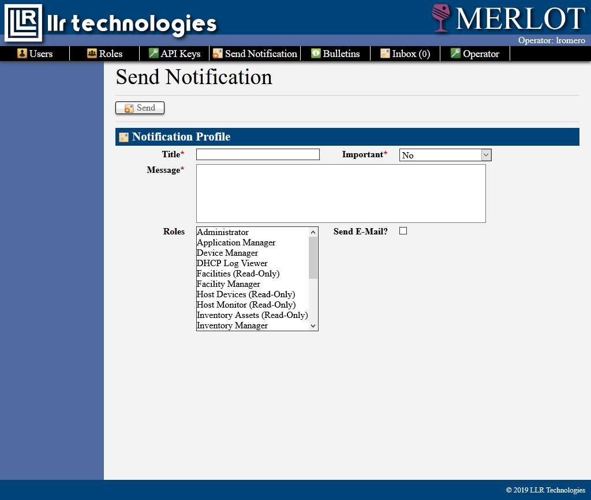
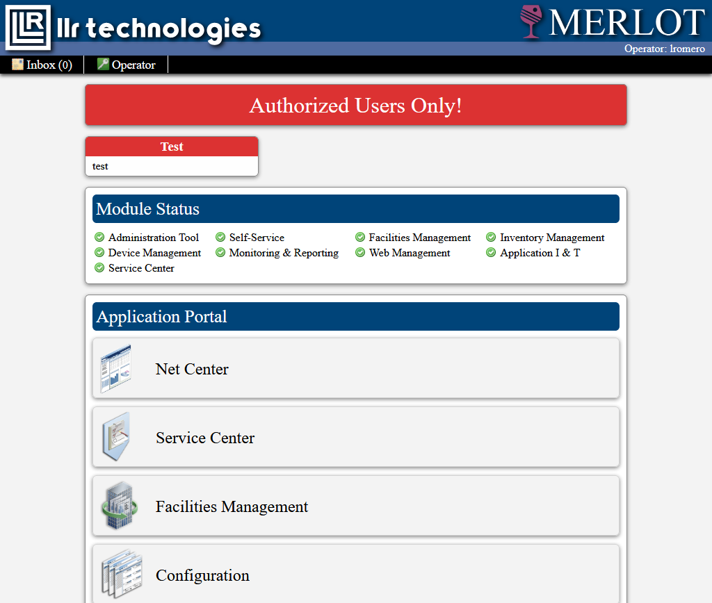
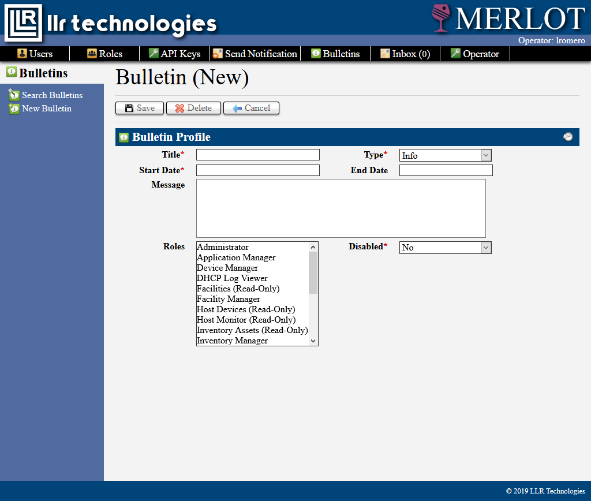

# MERLOT Technical Manual  
LLR Technologies & Associated Services  
Information Systems Development

## About LLR Technologies

LLR Technologies is an organization that provides technology services to organizations and individuals.  The Information
Systems and Development division designs and implements software solutions to satisfy business needs.

## About Mercury

The Mercury Application Platform (MAP, or Mercury for short) is a family of interoperable applications aimed at 
consolidating and streamlining the storage and processing of business data.  The Mercury Platform is made up of 
four software packages:

* MAP InfoCentral, a data processing layer, taking instructions and providing information through a REST application 
programming interface

* MAP InfoScape, a web based data browsing and manipulation interface

* MAP CenterView, itself a platform for creating dashboards linked to InfoCentral data

* MAP DoorWay, an interface for web browsers to be re-directed to other sites based on information in InfoCentral

## About MERLOT

MERLOT stands for "Mercury Logistics & Operations Tools"; it is an ever expanding suite of information management 
utilities programmed into the MAP applications.   MERLOT is presently divided into five different modules:

1. Network Central (NetCenter)

2. Service Center

3. Facilities Management

4. Configuration

5. Self-Service

The specific use-cases and functions of each will be covered in a later section.

## Installation

### Database

MERLOT was written for MySQL-compatible databases, including MariaDB.  The 'docs' folder in the InfoCentral source code 
contains several SQL scripts that need to be executed in a database, either newly created or existing.  It is recommended 
to run MERLOT in its own database.

The SQL script named '_init.sql' __must__ be run first.  Other scripts must be run in the order of roman numerals prefixing 
the script name; if one or more scripts have the same numeral, they can be run in any order amongst one another.  
This scripts creates the following object tables:

* User

* Token

* Secret

* Role

* Permission

* Notification

* Bulletin

* Attribute

* History

* HistoryItem

the following associative tables:

* User_Role

* Role_Permission

* Secret_Permission

and imports a list of Permission objects that MERLOT will need to operate.  

You will need to configure a user, or have one configured already, in the database to allow InfoCentral (and whatever host 
it will be running on) to perform create, insert, update, and delete operations on any table in this database.

### Web Applications

All MAP applications are laid out with a single 'public' in the 'src' directory of the source code intended to be the 
publicly accessible web root. Other directories above 'public' contain class files and configurations that should not be 
exposed to the end user. The recommended configuration for MAP is with each application running in its own virtual host; 
each virtual host can have the 'public' folder defined as its 'DocumentRoot', eliminating the possibility of access to 
unintended parts of the application.  If one virtual host is desired, with different MAP applications as sub-directories, 
it is recommended to use symbolic links from the single DocumentRoot to the 'public' directory of the MAP applications, 
which should be installed outside this folder.  

With this setup in place, both applications can now be configured.

## Configuration

### InfoCentral

Locate 'Config-Generic.class.php' in the 'src' directory.  This file must be renamed to 'Config.class.php'.  
This file contains the following options in the OPTIONS constant array:  

* baseURL, the __full__ URL that InfoCentral is running on, e.x. 'https://mercury.test.com/infocentral'

* baseURI, any part after the specified baseURL that needs to be added to access InfoCentral, this can usually be left 
as '/'

* databaseHost, Name, User, Password all refer to your database server, database name, and user account

* salt, a SALT that will be used when encrypting passwords

* allowMultipleSessions, if true, logging in from another location will not invalidate a User session

* ldapEnabled, allow LDAP accounts to be created

* ldapDomainController, the FQDN of your authoritative domain controller

* ldapDomain, the common name for your domain, e.x. 'TEST'

* ldapDomainDn, the DN of your domain, e.x. 'dc=test, dc=local'

* ldapUsername, Password refer to a Domain Administrator account that can change passwords and perform queries

* emailEnabled, allow email notifications to be sent

* emailHost, Port, Auth, Username, Password refer to host names and credentials from your email provider

* emailFromAddress, the address emails will be marked as sent from

* emailFromName, the name that will show up for the 'from' address

* validWebRootPaths, an array of allowed paths for the web root of a VHost object

* validWebLogPaths, an array of allowed paths for the log file of a VHost

* serviceCenterAgentURL, the URL to be attached to an email when notifying a ticket agent of an update

* serviceCenterRequestURL, the URL to be attached to an email when notifying a ticket contact of an update

* sshKeyPath, the directory path of a private key to be used to connect via SSH to other hosts

* dhcpServer, an optional DHCP server to pull log files from

* dhcpUser, the user to authenticate with to the above DHCP server

* dhcpLogPath, the path to the DHCP log file on remote server

### InfoScape

Locate 'Config-Generic.class.php' in the 'src' directory.  This file must be renamed to 'Config.class.php'.  
This file contains the following options in the OPTIONS constant array:  

* appName, the name to be displayed in the application, e.g. tab titles, about page

* companyName, this will appear under the company logo in the application header

* baseURL, this is the protocol, subdomain, domain, and TLD that InfoScape will be running on

* baseURI, specify if InfoScape is running in a subdirectory of the baseURL

* cookieName, the name of the session cookie

* icURL, the full path (including protocol) to the InfoCentral server

* icSecret, the InfoCentral-issued API key

* ipWhitelist, an optional array to specify IP addresses and networks (e.g. 10.10.1.11, 10.10.0.1/16) that are allowed
to access PublicDocuments set to filter traffic

## Accessing MERLOT

Navigate to the URL you specified in InfoScape's Config.php.  This will bring you to the MERLOT login page:

 

This page will display the current version of Mercury InfoScape you are running.  By default, the username is 'local' 
and the password is 'MercuryPassword'; this user has been assigned to a role called 'Administrator'.

After logging in you will see the Application Portal:

 

This is where all 'applications' (or modules of MERLOT) will be displayed.  By default 'local' will only see 
Configuration, Self-Service (My Account), and the Logout button.

## MERLOT Interface

The default MERLOT document, regardless of section or page, will include the Navigation Header.  This header will display 
the currently logged in operator in the upper right, and links to Inbox (with a count of new notifications) and the 
Operator menu.  The Operator menu contains the following options:

* My Account, go to the user account information page, with an option to change password

* About MERLOT, information about the current installation of the application

* Return To Portal, which will bring you back to the Application Portal

* Clear Session Cache, which will clear all cookies except fot the login session

* Logout, which will return the user to the login page

## In-App Configuration
 
 
 Clicking on 'Configuration' in the Application Portal will bring you to the MERLOT Configuration module.  This module
 has the following sections, which will now appear on the navigation header:
 
 * Users
    * Search Users
    * New User
    * Login History
    * Audit Permissions
 
 * Roles
    * Search Roles
    * New Role 
 
 * API Keys
    * Search API Keys
    * Issue API Key
 
 * Send Notification
 
 * Bulletins
    * Search Bulletins
    * New Bulletin

### Users

Users store identity information for a given operator, and also contain a list of assigned roles.

#### Creating a User

To create a user, click on 'New User'.  This will bring up the new user form that will let you enter the following
information:

* Username, a unique account identifier
* Roles, a multi-select of all roles currently configured in MERLOT
* Auth Type, LDAP or Local, if LDAP is selected, the following fields will be greyed out and auto-completed by your
LDAP server
* First Name
* Last Name
* E-Mail
* Disabled, will the user be prevented from logging in?
* Password, at least eight characters; there is no confirmation when setting the password from this page

#### Searching for Users

To search all current users, click on 'Search Users'.  This will allow you to enter the following criteria:

* First Name, user's authentication first name
* Last Name, user's authentication last name
* Username, user's username
* Disabled, whether the user object has been disabled through MERLOT

#### Modifying Users

To edit a user, click on their username from the search results.

This will be identical to the form shown when creating the user.  If the user authenticated with LDAP, you will not be
able to change certain fields; saving the user will update information from LDAP.

If you are changing between authentication types, note that an LDAP user with no password set will require a password 
before you can complete saving; if the user was formerly local and has a password, you will not be asked to enter one
again.

When editing a local user, the password field will be optional: not filling it out will preserve the existing password,
filling it out will change it.

#### Deleting Users

Users can only be deleted if they have not performed any operations, which link them to history entries.

#### Viewing User Login History

Clicking 'Login History' will bring you to a page allowing you to view the status of user Tokens.  You can filter 
results by the user's username, the remote IP address used to connect, and a date range.  Login history will
display when the user logged in, from what IP address, and when their session expired.  If a session is not marked as
expired, but expiration time has past, that means that the user did not click 'Logout'; their session is still invalid
and that Token cannot be used again.

#### Auditing Permissions

This page lets you search what users have the specified permission code.  For example, if you enter in 'settings', 
the 'local' user should show up.  Clicking the username will display a link to the edit-user form, and also 
links to all roles that user belongs to that grant that role; by default this should show 'Administrator'.

### Roles

Roles act as containers for permission codes.

#### Creating a role

Click 'New Role'.  The only required criteria for a role is a unique role name.  You can optionally add any combination
of configured permission codes.

#### Modifying a role

Select a role from the search results, make any changes to the form and save.

#### Deleting a role

A role may be deleted at any time, it will be unlinked from any users and permissions before being deleted.

### API Keys (Secrets)

#### Issuing API Keys

Click 'Issue API Key' and give the key a name and optional permissions; anything typed into 'Issued Key' will be 
overwritten on creation.

Permissions are only required if the API key will be used by a user-less client, when a user authenticated with an
application issued an API key, the user's permissions will be used, not the key's.

### Notifications

Clicking 'Send Notification' will bring you to a form allowing you to manually send emails to users based on their
assigned roles; a user will only receive the notification once, regardless of if they are part of multiple roles that
were selected.  Clicking 'Send E-Mail' will also send an email to the account they have on file, if one exists and if
emailing has been enabled and configured in the Config.

### Bulletins

Bulletins are messages that appear on the Application Portal above 'Module Status':

To create a bulletin, click 'New Bulletin' and fill in the following:

* Title, the title to be displayed in the bulletin header
* Type, Info will be green, Alert will be red
* Start Date, when the bulletin will start to appear
* End Date, when the bulletin will stop appearing (optional)
* Message, what the bulletin will say
* Roles, what roles will see the bulletin (will not be duplicated if a user is a member of multiple roles)
* Disabled, manually shut the bulletin off, regardless of End Date

## MERLOT Modules

MERLOT's core functionality is divided into modules: Net Center, Service Center, Facilities Management, Configuration 
(which was already covered), and User Self-Service.  The following sections will detail each module in-depth.

Before continuing, it is recommended that you set up Roles that will assign access to the various parts of MERLOT. 
At the very least, you should give the 'Administrator' role all permissions, which will let you see everything.

## Net Center

Network Central (Net Center) is a suite of ITSM and CMDB utilities useful for tracking information about your 
organization's network setup.  NetCenter is divided into the following sections:

* Inventory
    * Assets
    * Commodities
    * Purchase Orders
    * Discards
    * Warehouses
    * Vendors

* Devices
    * Hosts
    * DHCP Logs

* Web
    * VHosts
    * URL Aliases
    * Registrars

* Applications

* Monitor

## Service Center

Service Center is a ticketing system that supports separate workspaces and teams.  It is divided into the following
sections:

* Requests
* Agent
    * Service Desk
    * Advanced Search
* Admin
    * Workspaces
    * Teams

## Facilities Management

Facilities Management stores information on buildings and locations within those buildings, these locations are 
currently used by Net Center's asset system to determine where an asset is located.  It is divided into the following
sections:

* Buildings
    * Search Buildings
    * New Building

## User Self-Service (My Account)

## Application Structure

## Glossary

### Objects

1. User  
The entity that will be accessing the application and performing tasks.

1. Token  
The session of a user who is currently, or has been, logged in.  May be in an active or expired state.

1. Secret  
A key used to access the InfoCentral API without requiring a User.

1. Permission  
A static string that is used to determine access to parts of the application.

1. Role  
A set of Permission objects with a human-readable name.

1. Notification  
A message received by a User.

1. Bulletin  
A scheduled message tied to one or more Roles.

1. Attribute  
A state or descriptor tied to many different kinds of objects.

1. History  
A record of state change of an object, tied to the User who performed it.

1. HistoryItem  
An entry in a History object detailing the change in a specific attribute of an object.

### Permissions (as of InfoCentral 1.1.2)

Permission codes are (typically) laid out as <module>_<feature>-<subfeature>-<r/w/rw>.

* api-settings, perform all operations dealing with Secrets
* facilities, access the facilities portal
* facilitiescore_facilities-r, view buildings and locations
* facilitiescore_facilities-w, create,update,delete buildings and locations
* itsm, access the netcenter portal
* itsmmonitor, see the monitor tab
* itsmmonitor-hosts-r, view the network monitor
* itsmmonitor-hosts-w, edit network monitor categories
* itsm_ait, see the applications tab
* itsm_ait-apps-r, view applications
* itsm_ait-apps-w, create/update applications
* itsm_devices, view the devices tab
* itsm_devices-hosts-r, view hosts
* itsm_devices-hosts-w, create/update/delete hosts
* itsm_dhcplogs-r, view dhcp logs
* itsm_inventory, view the inventory tab
* itsm_inventory-assets-r, view assets
* itsm_inventory-assets-w, edit assets and use the asset worksheet, and view warehouse and building/location codes
* itsm_inventory-commodities-r, view commodities
* itsm_inventory-commodities-w, create/update/delete commodities
* itsm_inventory-discards-r, view discard orders
* itsm_inventory-discards-w, create/update discard orders
* itsm_inventory-purchaseorders-r, view purchase orders
* itsm_inventory-purchaseorders-w, create/update purchase orders, and view commodity codes/names
* itsm_inventory-settings-rw, configure commodity asset types
* itsm_inventory-vendors-r, view commodity vendors
* itsm_inventory-vendors-w, create/update/delete commodity vendors
* itsm_inventory-warehouses-r, view asset warehouses
* itsm_inventory-warehouses-w, create/update/delete asset warehouses
* itsm_web, view the web tab
* itsm_web-aliases-rw, create/update/delete URL aliases
* itsm_web-registrars-r, view domain registrars
* itsm_web-registrars-w, create/update/delete domain registrars
* itsm_web-vhosts-r, view virtual hosts
* itsm_web-vhosts-w, create/update/delete virtual hosts, view host devices 
* itsm_weblogs, view web logs for a virtual host
* settings, configure users, roles, bulletins, and send notifications
* tickets, view the ticket portal
* tickets-admin, configure workspaces and teams
* tickets-agent, view the agent tab, service desk, and workspaces the agent is assigned to
* tickets-customer, view the request portal and use it to submit request tickets

### InfoCentral Routes (as of InfoCentral 1.1.2)

This is a breakdown of all API routes currently in InfoCentral.  If a requesting agent does not have permission to 
use a route, InfoCentral will typically return response code 401, if an object is not found 404, and if a form submission
has validation errors 400 will be returned along with an array 'errors' detailing what went wrong.

The following breakdown (attempts to) follow this notation:
* /route [permissions]  
* array(type{fields})  
* responseCode{responseBody}

#### Core
* /history
    * GET /history
        * document body: {object, index, action, username}
        * returns: 200{array(user{id, username, time, action, array(changes)})}
* /users [settings, tickets-admin]
    * GET /users
        * returns: 200{array(user{id, username, firstName, lastName, email, disabled, authType})}
    * GET /users/$id [settings]
        * returns: 200{id, username, firstName, lastName, email, disabled, authType, array(roles{id, name})}
    * GET /users/$id/roles [settings]
        * returns: 200{array(roles{id, name})}
    * GET /users/$id/permissions [settings]
        * returns: 200{array(permissions{code})}
    * POST /users/search [settings]
        * document body: {username, firstName, lastName, disabled}
        * returns: 200{array(user{id, username, firstName, lastName, email, disabled, authType, array(roles{id, name})})}
    * POST /users [settings]
        * document body: {username, firstName, lastName, email, password, disabled, authType, array(roles{id})}
        * returns: 201{id}
    * PUT /users [settings]
        * document body: {username, firstName, lastName, email, password, disabled, authType, array(roles{id})}
        * returns: 204
    * DELETE /users/$id [settings]
        * returns: 204
    
* /roles [settings]
    * GET /roles
        * returns: 200{array(role{id, name})}
    * GET /roles/$id
        * returns: 200{id, name}
    * GET /roles/$id/permissions
        * returns: 200{array(permission{code})}
    * POST /roles
        * document body: {name, array(permission{code})}
        * returns: 201: {id}  
    * POST /roles/search
        * document body: {name}
        * returns: 200{array(role{id, name})}    
    * PUT /roles/$id
        * document body: {name, array(permission{code})}
        * returns 204
    * DELETE /roles/$id
        * returns 204
        
* /permissions [settings]
    * GET /permissions
        * returns 200{array(permission{code})}
    * POST /permissions/audit
        * document body: array(permission{code})
        * returns: 200{array(user{id, username, firstName+lastName})}
    * POST /permissions/audit/$userId
        * returns 200{array(role{id, name})}

* /currentUser
    * GET /currentUser/roles
        * returns: 200{array(role{id, name})}
    * GET /currentUser/permissions
        * returns: 200{array(permission{code})}
    * GET /currentUser/unreadNotificationCount
        * returns 200{count}
    * GET /currentUser/unreadNotifications
        * returns 200{array(notification{id, title, time, data})}
    * GET /currentUser/bulletins
        * returns 200{array(bulletin{title, message, type})}
    * GET /currentUser/notifications
        * returns 200{array(notification{id, title, time, data})}
    * GET /currentUser/notifications/$id
        * returns 200{id, title, time, data}
    * DELETE /currentUser/notifications/$id
        * returns 204
    * PUT /currentUser/changePassword
        * document body: {old, new, confirm}
        * returns 204
    
* /authenticate
    * POST /authenticate/login
        * document body: {username, password, remoteAddr}
        * returns 201{token}    
    * PUT /authenticate/logout
        * returns 204
    
* /bulletins [settings]
    * GET /bulletins
        * returns 200{array(role{id, startDate, endDate, title, inactive, type})}
    * GET /bulletins/$id
        * returns 200{id, startDate, endDate, title, message, inactive, type, array(roles{id, name})}
    * POST /bulletins
        * document body: {startDate, endDate, title, message, inactive, type, roles}
        * returns 201{id}
    * POST /bulletins/search
        * document body: {startDate, endDate, title, message, inactive, type, roles}
        * returns 200{array(role{id, startDate, endDate, title, inactive, type})}
    * PUT /bulletins/$id
        * document body: {startDate, endDate, title, message, inactive, type, roles}
        * returns 204
    * DELETE /bulletins/$id
        * returns 204

* /secrets [api-settings]
    * GET /secrets
        * returns 200{array(secret{id, name})}
    * GET /secrets/$Id
        * returns 200{id, name, secret, array(permissions{code})}
    * POST /secrets
        * document body: {name, permissions}
        * returns 201{id}
    * PUT /secrets/$id
        * document body: {name, permissions}
        * returns 204 
    * DELETE /secrets/$id
        * returns 204
    
* /tokens [settings]
    * POST /tokens/search
        * document body: {username, ipAddress, startDate, endDate}
        * returns 200{array(token{user, ipAddress, issueTime, expireTime, expired})}
    
* /notifications [settings]
    * POST /notifications
        * document body: {title, data, important, email, roles}
        * returns 201{count}

#### Facilities
* /buildings [facilitiescore_facilities-r, itsm_inventory-assets-w]
    * GET /buildings
        * returns 200{array(building{id, code, name, streetAddress, city, state, zipCode})}
    * GET /buildings/$id
        * returns 200{id, code, name, streetAddress, city, state, zipCode}
    * GET /buildings/$id/locations
        * returns 200{array(location{id, code, name})}
    * POST /buildings  [facilitiescore_facilities-w]
        * document body: {code, name, streetAddress, city, state, zipCode}
        * returns 201{id}
    * POST /buildings/search
        * document body: {code, name, streetAddress, city, state, zipCode}
        * returns 200{array(building{id, code, name, streetAddress, city, state, zipCode})}
    * PUT /buildings/$id [facilitiescore_facilities-w]
        * document body: {code, name, streetAddress, city, state, zipCode}
        * returns 204
    * DELETE /buildings/$id  [facilitiescore_facilities-w]
        * returns 204
* /locations [facilitiescore_facilities-r, itsm_inventory-assets-w]
    * GET /locations/$id
        * returns 200{id, buildingId, buildingCode, buildingName, code, name}
    * POST /location/$buildingId [facilitiescore_facilities-w]
        * document body: {code, name}
        * returns 201{id}
    * DELETE /locations/$id [facilitiescore_facilities-w]
        * returns 204
    * PUT /locations/$id [facilitiescore_facilities-w]
        * document body: {code, name}
        * returns 204

#### Inventory
* /commodities [itsm_inventory-purchaseorders-w, itsm_inventory-commodities-r, itsm_inventory-assets-r]
    * GET /commodities
        * returns 200{array(commodity{id, code, name, commodityType, assetType, manufacturer, model})}
    * GET /commodities/$id
        * returns 200{id, code, name, commodityType, commodityTypeName, assetType, assetTypeName, manufacturer, model, unitCost}
    * GET /commodities/commodityTypes
        * returns 200{array(attribute{id, code, name})}
    * GET /commodities/assetTypes
        * returns 200{array(attribute{id, code, name})}
    * PUT /commodities/$id [itsm_inventory-commodities-w]
        * document body: {code, name, commodityType, assetType, manufacturer, model, unitCost}
        * returns 204
    * PUT /commodities/assetTypes/$id [itsm_inventory-commodities-w]
        * document body: {code, name}
        * returns 204
    * POST /commodities/search
        * document body: {code, name, commodityType, assetType, manufacturer, model, unitCost}
        * returns 200{array(commodity{id, code, name, commodityType, assetType, manufacturer, model})}
    * POST /commodities [itsm_inventory-commodities-w]
        * document body: {code, name, commodityType, assetType, manufacturer, model, unitCost}
        * returns 201{id}
    * POST /commodities/assetTypes [itsm_inventory-commodities-w]
        * document body: {code, name}
        * returns 201{id}
    * DELETE /commodities/$id [itsm_inventory-commodities-w]
        * returns 204
    * DELETE /commodities/assetTypes/$id [itsm_inventory-commodities-w]
        * returns 204
    
* /warehouses [itsm_inventory-warehouses-r, itsm_inventory-assets-r]
    * GET /warehouses
        * returns 200{array(warehouse{code, name})}
    * GET /warehouses/$id
        * returns 200{id, code, name, closed}
    * POST /warehouses
        * document body: {code, name}
        * returns 201{id}
    * POST /warehouses/search
        * document body: {code, name}
        * returns 200{array(warehouse{code, name})}        
    * PUT /warehouses/$id
        * returns 204
    * DELETE /warehouses/$id
        * returns 204

* /vendors [itsm_inventory-vendors-r, itsm_inventory-purchaseorders-w]
    * GET /vendors
        * returns 200{array(vendor{id, code, name})}
    * GET /vendors/$id
        * returns 200{id, code, name, streetAddress, city, state, zipCode, phone, fax}
    * POST /vendors
        * document body: {code, name, streetAddress, city, state, zipCode, phone, fax}
        * returns 201{id}
    * POST /vendors/search
        * document body: {code, name, streetAddress, city, state, zipCode, phone, fax}
        * returns 200{array(vendor{id, code, name})}
    * PUT /vendors/$id
        * document body: {code, name, streetAddress, city, state, zipCode, phone, fax}
        * returns 204
    * DELETE /vendors/$id
        * returns 204

* /assets [itsm_inventory-assets-r]
    * GET /assets
        * returns 200{array(asset{inWorksheet, assetTag, commodityCode, commodityName, assetType, serialNumber, location, warehouse, verified})}
    * GET /assets/$id
        * returns 200{assetTag, inWorksheet, commodity, commodityCode, commodityName, commodityType, commodityManufacturer, 
        commodityModel, assetType, warehouse, warehouseCode, warehouseName, parentAssetTag, location, building, buildingCode, 
        buildingName, locationCode, locationName, serialNumber, manufactureDate, purchaseOrder, notes, discarded, discardDate, 
        discardOrder, verified, verifyDate}
    * GET /assets/$id/children
        * return 200{array(asset{assetTag, commodityName})}       
    * POST /assets/search
        * document body: {assetTag, serialNumber, inWarehouse, isDiscarded, buildingCode, locationCode, warehouseCode, 
        purchaseOrder, manufacturer, model, commodityCode, commodityName, commodityType, assetType, isVerified, notes}
        * returns 200{array(asset{inWorksheet, assetTag, commodityCode, commodityName, assetType, serialNumber, location, warehouse, verified})}
    * POST /assets/$id/parent [itsm_inventory-assets-w]
        * document body: {parentAssetTag}
        * returns 204
    * PUT /assets/$id  [itsm_inventory-assets-w]
        * document body: {assetTag, serialNumber, notes, manufactureDate}
        * returns 204
    * PUT /assets/$id/verify  [itsm_inventory-assets-w]
        * returns 204
    * PUT /assets/$id/unverify  [itsm_inventory-assets-w]
        * returns 204
    * PUT /assets/$id/location  [itsm_inventory-assets-w]
        * document body: {buildingCode, locationCode}
        * returns 204
    * PUT /assets/$id/warehouse  [itsm_inventory-assets-w]
        * document body: {locationCode}
        * returns 204
    * DELETE /assets/$id/parent  [itsm_inventory-assets-w]
        * returns 204
    * GET /assets/worksheet
        * returns 200{array(asset{assetTag, commodityCode, commodityName, assetType, serialNumber, location, warehouse, verified})}
    * GET /assets/worksheet/count
        * returns 200{count}
    * PUT /assets/worksheet/location  [itsm_inventory-assets-w]
        * document body: {buildingCode, locationCode}
        * returns 204
    * PUT /assets/worksheet/warehouse  [itsm_inventory-assets-w]
        * document body: {warehouseCode}
        * returns 204
    * PUT /assets/worksheet/verify  [itsm_inventory-assets-w]
        * returns 204
    * PUT /assets/worksheet/unverify  [itsm_inventory-assets-w]
        * returns 204
    * POST /assets/worksheet  [itsm_inventory-assets-w]
        * document body: {array(asset{id})}
        * returns 201
    * DELETE /assets/worksheet/$assetId  [itsm_inventory-assets-w]
        * returns 204
    * DELETE /assets/worksheet [itsm_inventory-assets-w]
        * returns 200{removed}
        
* /purchaseorders [itsm_inventory-purchaseorders-r]
    * GET /purchaseorders
        * returns 200{array(purchaseorder{number, orderDate, warehouseCode, warehouseName, vendorCode, vendorName, status})}
    * GET /purchaseorders/$number
        * returns 200{number, orderDate, warehouse, warehouseCode, warehouseName, vendor, vendorCode, vendorName, status, 
        notes, sent, sendDate, received, receiveDate, canceled, cancelDate} 
    * GET /purchaseorders/statuses
        * returns 200{array(attribute{code, name})}
    * GET /purchaseorders/$number/commodities
        * returns 200{array({id, commodity, commodityCode, commodityName, quantity, unitCost})}
    * GET /purchaseorders/$number/costitems
        * returns 200{array(costitem{id, cost, notes})}
    * POST /purchaseorders [itsm_inventory-purchaseorders-w]
        * document body: {orderDate, warehouse, vendor, notes}
        * return 201{number}
    * POST /purchaseorders/search
        * document body: {number, vendor, warehouse, orderStart, orderEnd, status}
        * returns 200{array(purchaseorder{number, orderDate, warehouseCode, warehouseName, vendorCode, vendorName, status})}
    * POST /purchaseorders/$number/commodities [itsm_inventory-purchaseorders-w]
        * document body: {commodity, quantity, unitCost}
        * returns 201
    * POST /purchaseorders/$number/costitems [itsm_inventory-purchaseorders-w]
        * document body: {cost, notes}
        * returns 201
    * PUT /purchaseorders/$number [itsm_inventory-purchaseorders-w]
        * document body: {orderDate, warehouse, vendor, notes}
        * returns 204
    * PUT /purchaseorders/$number/send [itsm_inventory-purchaseorders-w]
        * returns 204
    * PUT /purchaseorders/$number/cancel [itsm_inventory-purchaseorders-w]
        * returns 204
    * PUT /purchaseorders/$number/receive [itsm_inventory-purchaseorders-w]
        * document body: {receiveDate, startAssetTag}
        * returns 204
    * DELETE /purchaseorders/$number/commodities/$commodity [itsm_inventory-purchaseorders-w]
        * returns 204
    * DELETE /purchaseorders/$number/costitems/$costItem [itsm_inventory-purchaseorders-w]
        * returns 204
    
* /discardorders [itsm_inventory-discards-r]
    * GET /discardorders
        * returns 200{array(discard{number, date, approved, fulfilled, canceled})}
    * GET /discardorders/$number
        * returns 200{number, notes, date, approved, approveDate, fulfilled, fulfillDate, canceled, cancelDate}
    * GET /discardorders/$number/assets
        * returns 200{array(asset{assetTag, serialNumber})}
    * PUT /discardorders/$number [itsm_inventory-discards-w]
        * document body: {notes}
        * returns 204
    * PUT /discardorders/$number/approve [itsm_inventory-discards-w]
        * returns 204
    * PUT /discardorders/$number/fulfill [itsm_inventory-discards-w]
        * returns 204
    * PUT /discardorders/$number/cancel [itsm_inventory-discards-w]
        * returns 204
    * POST /discardorders [itsm_inventory-discards-w]
        * document body: {notes}
        * returns 201{number}
    * POST /discardorders/$number/search
        * document body: {number, startDate, endDate, approved, fulfilled, canceled}
        * returns 200{array(discard{number, date, approved, fulfilled, canceled})}
    * POST /discardorders/$number/assets [itsm_inventory-discards-w]
        * document body: {assetTag}
        * returns 204
    * DELETE /discardorders/$number/assets [itsm_inventory-discards-w]
        * returns 204

#### Devices
* /hosts [itsm_devices-hosts-r, itsm_ait-apps-w]
    * GET /hosts
        * returns 200{array(host){id ipAddress, macAddress, assetTag, systemName}}
    * GET /hosts/$id
        * returns 200{id, ipAddress, macAddress, assetTag, systemName, systemCPU, systemRAM, systemOS, systemDomain}
    * POST /hosts [itsm_devices-hosts-w]
        * document body: {assetTag, ipAddress, macAddress, systemName, systemCPU, systemRAM, systemOS, systemDomain}
        * returns 201{id}
    * POST /hosts/search
        * document body: {assetTag, ipAddress, macAddress, systemName, systemCPU, systemRAM, systemOS, systemDomain}
        * returns 200{array(host){id ipAddress, macAddress, assetTag, systemName}}
    * PUT /hosts/$id [itsm_devices-hosts-w]
        * document body: {assetTag, ipAddress, macAddress, systemName, systemCPU, systemRAM, systemOS, systemDomain}
        * returns 204
    * DELETE /hosts/$id [itsm_devices-hosts-w]
        * returns 204
        
* /hostCategories [itsmmonitor-hosts-r]
    * GET /hostCategories
        * returns 200{array(category{id, name, displayed})}
    * GET /hostCategories/displayed
        * returns 200{array(category{id, name, displayed})}
    * GET /hostCategories/$id
        * returns 200{id, name, displayed, array(host{id, ipAddress, systemName})}
    * GET /hostCategories/$id/status
        * returns 200{id, name, displayed, array(host{id, ipAddress, systemName, status})}
    * POST /hostCategories [itsmmonitor-hosts-w]
        * document body: {name, displayed, hosts}
        * returns 201{id}
    * PUT /hostCategories/$id [itsmmonitor-hosts-w]
        * document body: {name, displayed, hosts}
        * returns 204
    * DELETE /hostCategories/$id [itsmmonitor-hosts-w]
        * returns 204

#### Web
* /vhosts [itsm_web-vhosts-r, itsm_ait-apps-w]
    * GET /vhosts
        * returns 200{array(vhost{id, subdomain, domain, name, registrar, registrarName, status, statusName, host, hostName})}
    * GET /vhosts/$id
        * returns 200{id, subdomain, domain, name, host, ipAddress, registrar, registrarCode, registrarName, status, 
        renewCost, webRoot, logPath, notes, registerDate, expireDate}
    * GET /vhosts/statuses
        * returns 200{array(attribute{id, code, name})}
    * GET /vhosts/$id/logs
    * POST /vhosts [itsm_web-vhosts-w]
        * document body: {domain, subdomain, name, host, status, registrar, renewCost, notes, webRoot, logPath, registerDate, expireDate}
        * returns 201{id}
    * POST /vhosts/search
        * document body: {domain, subdomain, name, host, registrar, status}
        * returns 200{array(vhost{id, subdomain, domain, name, registrar, registrarName, status, statusName, host, hostName})}
    * PUT /vhosts/$id [itsm_web-vhosts-w]
        * document body: {domain, subdomain, name, host, status, registrar, renewCost, notes, webRoot, logPath, registerDate, expireDate}
        * returns 204
    * DELETE /vhosts/$id [itsm_web-vhosts-w]
        * returns 204
        
* /registrars [itsm_web-registrars-r]
    * GET /registrars
        * returns 200{array(vhost{id, code, name})}
    * GET /registrars/$id
        * returns 200{id, code, name, url, phone}
    * POST /registrars [itsm_web-registrars-w]
        * document body: {code, name, url, phone}
        * returns 201{id}
    * POST /registrars/search
        * document body: {code, name}
        * returns 200{array(vhost{id, code, name})}
    * PUT /registrars/$id [itsm_web-registrars-w]
        * document body: {code, name, url, phone}
        * returns 204
    * DELETE /registrars$id [itsm_web-registrars-w]
        * returns 204
    
* /urlaliases [itsm_web-aliases-rw]
    * GET /urlaliases
        * returns 200{array(alias{id, alias, destination, disabled})}
    * GET /urlaliases/$id
        * returns 200{id, alias, destination, disabled}
    * POST /urlaliases/search
        * document body: {alias, destination, disabled}
        * returns 200{array(alias{id, alias, destination, disabled})}
    * POST /urlaliases
        * document body: {alias, destination, disabled}
        * returns 201{od}
    * PUT /urlaliases/$id
        * document body: {alias, destination, disabled}
        * returns 204
    * DELETE /urlaliases/$id
        * returns 204

#### AIT
* /applications [itsm_ait-apps-r]
    * GET /applications
        * returns 200{array(application{number, name, type, status, owner})}
    * GET /applications/$number
        * returns 200{number, name, description, owner, type, typeName, status, statusName, publicFacing, lifeExpectancy, 
        lifeExpectancyName, dataVolume, dataVolumeName, authType, authTypeName, port, array(appHosts{id, systemName, ipAddress}), 
        array(webHosts{id, systemName, ipAddress}), array(dataHosts{id, systemName, ipAddress}), array(vHosts{id, domain, subdomain})}
    * GET /applications/types
        * returns 200{array(attribute{id, code, name})}
    * GET /applications/lifeExpectancies
        * returns 200{array(attribute{id, code, name})}
    * GET /applications/dataVolumes
        * returns 200{array(attribute{id, code, name})}
    * GET /applications/authTypes
        * returns 200{array(attribute{id, code, name})}
    * GET /applications/statuses
        * returns 200{array(attribute{id, code, name})}
    * POST /applications [itsm_ait-apps-w]
        * document body: {number, name, description, owner, type, publicFacing, lifeExpectancy, dataVolumes, authType, 
        port, host, vhost, status, webHosts, appHosts, dataHosts, vHosts}
        * returns 201{$number}
    * POST /applications/search
        * document body: {number, name, description, owner, type, publicFacing, lifeExpectancy, dataVolumes, authType, 
        port, host, vhost, status, webHosts, appHosts, dataHosts, vHosts}
        * returns 200{array(application{number, name, type, status, owner})}
    * PUT /applications/$number  [itsm_ait-apps-w]
        * document body: {number, name, description, owner, type, publicFacing, lifeExpectancy, dataVolumes, authType, 
        port, host, vhost, status, webHosts, appHosts, dataHosts, vHosts}
        * returns 204

#### DHCP Logs
* /dhcplogs [itsm_dhcplogs-r]
    * GET /dhcplogs
        * returns 200{array(logLine)}

#### Tickets * /tickets